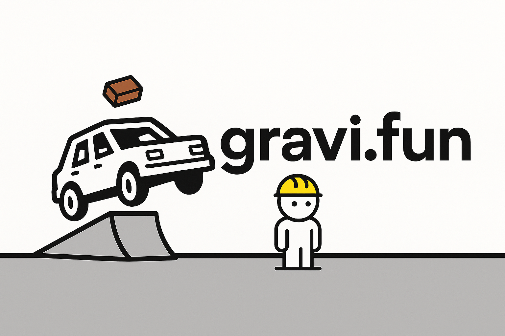

<p align="center">
  <a href="https://gravi.fun"></a>
  <br>
  <a href="https://gravi.fun">Live Demo</a>
</p>

# About GraviFun

A lightweight 3D game engine built with [three.js](https://threejs.org/) and [cannon.js](https://github.com/schteppe/cannon.js), specializing in third-person character mechanics and physics-based interactions. Originally developed as a playground for exploring game mechanics, now available for community use and development.

## Current Status (June 2025)

This project is actively maintained, follow our updates on Discord(link soon). You can:
- Fork and modify the code
- Check [Network Graph](https://github.com/GraviFun/gravi.fun/network) for active community forks

## Key Features

### Core Engine
- Hybrid rendering system (Three.js + Cannon.js physics)
- Adjustable timescale with frame skipping
- FXAA anti-aliasing for smoother visuals

### Character System
- Advanced third-person camera controls
- Capsule-collision character controller
- Modular state system for behaviors
- Basic AI framework

### Vehicle Physics
- Realistic car handling
- Aircraft flight models
- Helicopter rotor physics

## Installation & Usage

### Quick Start
1. Clone the repository:
   ```bash
   git clone https://github.com/GraviFun/gravi.fun.git
   cd gravi.fun
2. Install dependencies:
    ```bash
    npm install
3. Start development server:

    ```bash
    npm run dev
4. Open in browser:
    http://localhost:8080

### Loading Custom Scenes
1. Export your 3D scene as GLB from Blender

2. Place the file in your project's assets folder

3. Initialize in your code:

    ```javascript
    const world = new Gravifun.World('path/to/your/scene.glb');

## Building the Project
To create a production build:

    npm run build
    
This will generate optimized files in the ```dist/``` directory.

## Contributing
While this project isn't actively maintained, we welcome community contributions:

1. Fork the repository

2. Create your feature branch (```git checkout -b feature/yourfeature```)

3. Commit your changes (```git commit -m 'Add some Feature'```

4. Push to the branch (```git push origin feature/yourfeature```)

5. Open a Pull Request

## Learning Resources
[Three.js Documentation](https://threejs.org/docs/)

[Cannon.js Examples](https://github.com/schteppe/cannon.js/tree/master/examples)

[GLB/GLTF Format Specifications](https://www.khronos.org/gltf/)

## License
Gravifun is released under the MIT License. See [LICENSE](https://github.com/GraviFun/gravi.fun/blob/main/LICENSE) for details.
